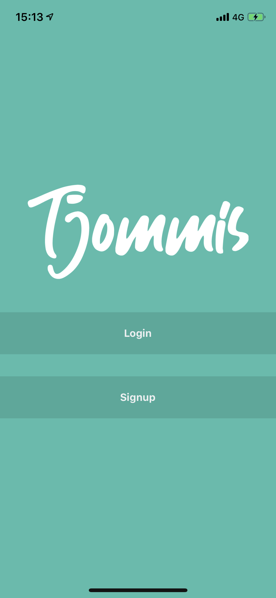
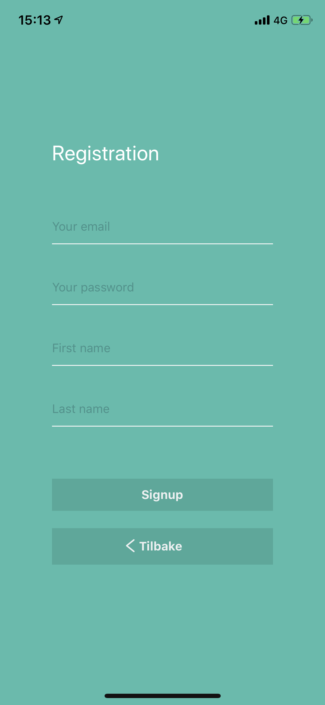
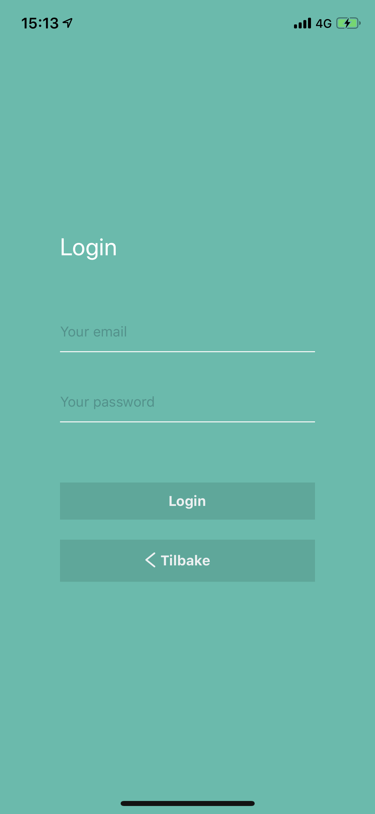
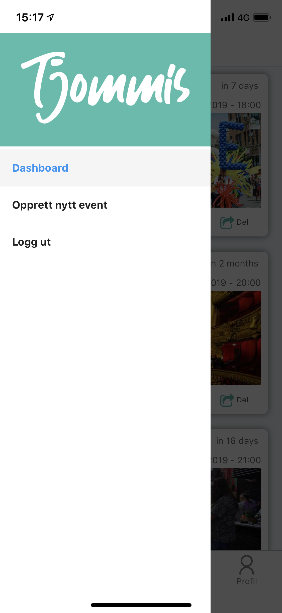
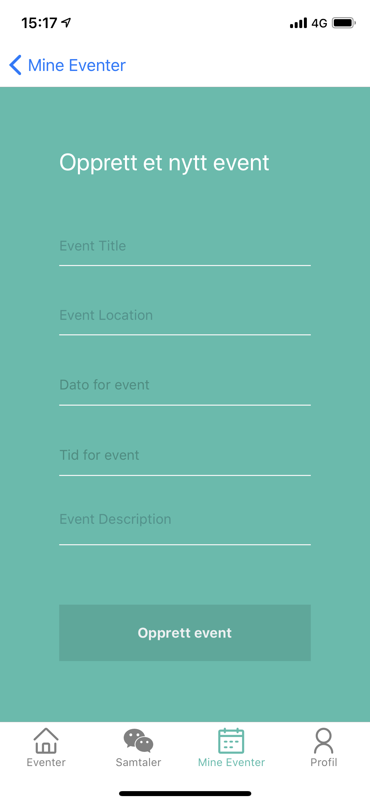
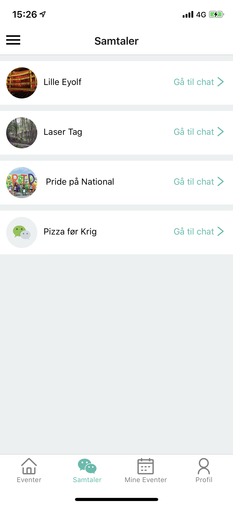
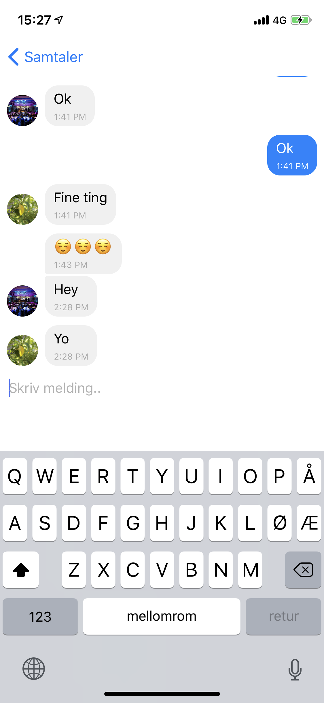
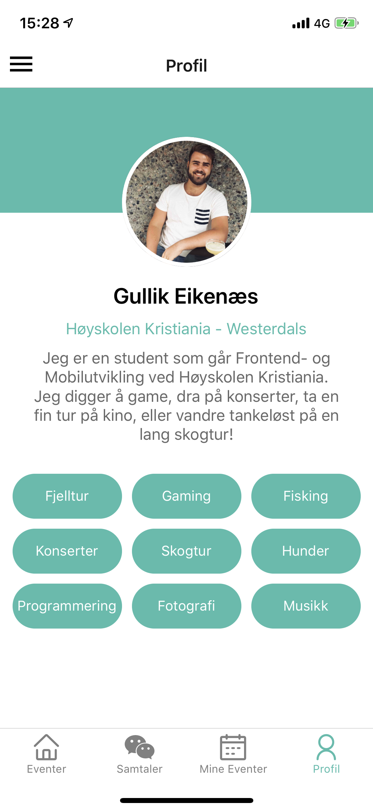

# Tjommis

Run npm install or  yarn install to install dependencies.

Follow these instructions to set up the Android and iOS Emulator to see the React Project
<https://facebook.github.io/react-native/docs/getting-started.html>

Some examples of the finished product app

##Start page

##Registration page

##Login page

##Event page

##Sidebar page

##My events page

##Make an event page

##One event page

##Chat overview page

##Chat page

##Profile page

